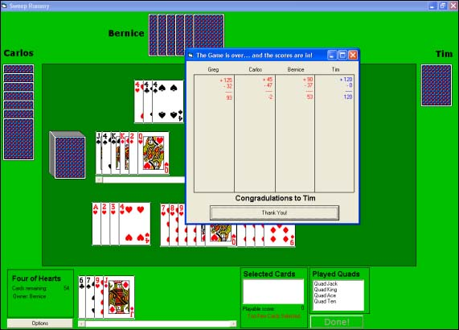



## Fully Feauted Card Game with AI

### Description

This is a Visual Basic implementation of Sweep Rummy (very similar to Rummy, Tile Rummy or Rummikub). It makes extensive use of classes and user controls as it was my final year project.

The game is pretty much self-explanatory although there are a few things you should know. You can right click and drag on played cards to move them. A turn consists of a draw phase, in which you can either click on the pack for a new card or double click on any card in the stack next to the deck to pick up from there. Finally at the end of your turn you must select one card and click done. This is your discard phase. To swap a joker, just select the right card and click on the joker card (its the odd robot or fish depending on the DLL you are using). To add cards to something on the table, just select them and click on the cards you want to add them too - you can add multiple cards at once.

Due to certain problems involving hard drives, I had to write this in three days... and so there are a few minor issues. I can't seem to find the version in which I fixed the card sorting problem (ACES and Jokers appear on the end, instead of their possible places). There is also the problem of placing cards down on the table, they tend to overlap most of the time. Hopefully I'll find it again.

I made use of a couple of snippits of code for the card drawing functions. I have no idea from whom they came and if you recognize anything please tell me so that I can acknowledge you.

Thanks

Greg
 
### More Info
 

             |
---                |---
**Submitted On**   |2002-08-25 22:41:00
**By**             |[Greg Cohen](https://github.com/Planet-Source-Code/PSCIndex/blob/master/ByAuthor/greg-cohen.md)
**Level**          |Advanced
**User Rating**    |4.3 (13 globes from 3 users)
**Compatibility**  |VB 6\.0
**Category**       |[Games](https://github.com/Planet-Source-Code/PSCIndex/blob/master/ByCategory/games__1-38.md)
**World**          |[Visual Basic](https://github.com/Planet-Source-Code/PSCIndex/blob/master/ByWorld/visual-basic.md)
**Archive File**   |[Fully\_Feau14839810192002\.zip](https://github.com/Planet-Source-Code/greg-cohen-fully-feauted-card-game-with-ai__1-39960/archive/master.zip)

